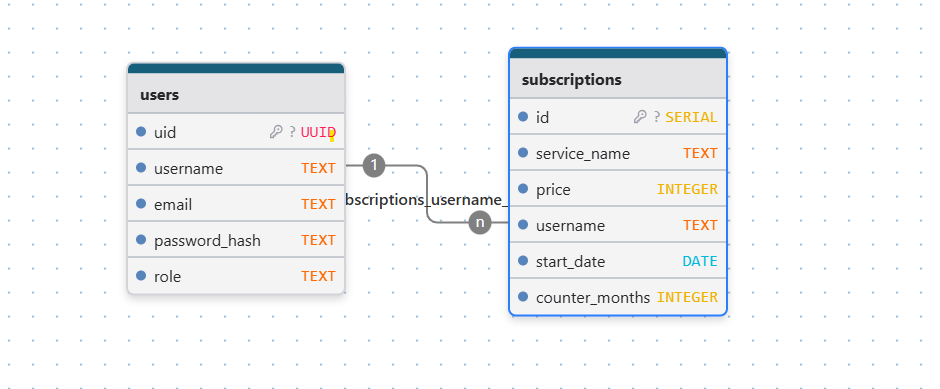

# Subscription Aggregator API

## Описание
Subscription Aggregator — HTTP API‑сервис на Go для управления пользовательскими подписками.
Поддерживает регистрацию пользователей, полный набор CRUD‑операций с подписками, подсчёт суммарной стоимости за период и авторизацию через JWT.

В проекте реализована асинхронная система уведомлений пользователей об окончании подписок с помощью RabbitMQ и отправкой email через SMTP с поддержкой STARTTLS, обеспечивающая масштабируемую и надёжную рассылку уведомлений.

## Роли и права доступа
- В системе реализованы две основные роли: admin и обычный пользователь (user).
- Пользователи с ролью admin имеют расширенные права и могут получать информацию о всех пользователях и их подписках.
- Обычные пользователи через стандартный эндпоинт list могут просматривать только свои собственные подписки и данные.
- Для удобства администрирования и начальной настройки в системе предусмотрен сервисный аккаунт администратора с логином admin и паролем adminadmin1234.

## Возможности
- Регистрация и аутентификация пользователей с помощью JWT.
- Создание, чтение, обновление и удаление подписок.
- Получение списка подписок с поддержкой пагинации.
- Подсчёт суммарной стоимости подписок с применением фильтров.
- Асинхронная обработка задач с использованием RabbitMQ для гарантированной доставки уведомлений.
- Отправка email-уведомлений пользователям через SMTP (mail.ru) с поддержкой защищённого соединения STARTTLS.
- Контроль параллелизма обработки сообщений и устойчивость к ошибкам.
- Хранение данных в PostgreSQL.
- Кэширование данных в Redis.
- Валидация входных данных с развёрнутыми описаниями ошибок.
- Структурированное логирование запросов, ошибок и процессов отправки уведомлений.
- Документация по Swagger/OpenAPI для всех эндпоинтов.
- Graceful shutdown сервера для корректного завершения работы.
- gRPC используется для централизованной авторизации и аутентификации, обеспечивая проверку JWT токенов и управление безопасностью через отдельный сервис.
- Интеграционные и юнит-тесты с моками обеспечивают проверку ключевой логики.
- Настроен CI на GitHub Actions с запуском тестов.
- Весь исходный код задокументирован и проверен с помощью golangci-lint.

## Миграции базы данных
В проекте реализованы миграции для управления схемой базы данных, включающие:
- Инициализацию основных таблиц
- Добавление необходимых индексов для оптимизации запросов
- Создание учетной записи администратора при первом запуске

## Структура базы данных 

## Технологии
- Go 1.23.1
- PostgreSQL 15
- Redis 7
- JWT (github.com/golang-jwt/jwt/v5)
- bcrypt для хэширования паролей
- Chi router
- go-playground/validator
- slog для структурированного логирования
- Swagger через swaggo
- gRPC для межсервисного взаимодействия по авторизации
- RabbitMQ для асинхронной обработки уведомлений и задач
- SMTP с поддержкой STARTTLS для безопасной отправки email уведомлений

## Сервисы, которые поднимаются:
- PostgreSQL (порт 5433)
- Redis (порт 6379)
- Go API‑сервис (порт 8080)
- gRPC-сервис (порт 50051)
- RabbitMQ (порт 5672)

## Основные эндпоинты
| Метод  | Путь                          | Описание                                               |
|--------|-------------------------------|--------------------------------------------------------|
| POST   | /api/v1/register              | Регистрация                                            |
| POST   | /api/v1/login                 | Логин, получение JWT                                   |
| POST   | /api/v1/subscriptions/        | Создание подписки                                      |
| GET    | /api/v1/subscriptions/{id}    | Получение подписки по ID                               |
| PUT    | /api/v1/subscriptions/{id}    | Обновление подписки                                    |
| DELETE | /api/v1/subscriptions/{id}    | Удаление подписки                                      |
| GET    | /api/v1/subscriptions/list    | Получение списка подписок                              |
| POST   | /api/v1/subscriptions/sum     | Подсчёт суммы подписок с фильтрами                     |

## TODO
1. Платежный шлюз
2. Дальнейшее расширение функционала уведомлений
